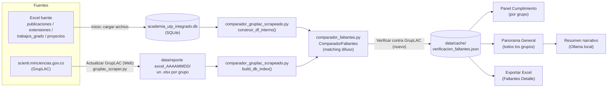

# ReportSoft — Consolidados

Aplicación de escritorio (PyQt5) para consolidar la producción académica de
los grupos de investigación de la Universidad Tecnológica de Pereira
(publicaciones, extensiones, trabajos de grado, proyectos) y verificarla
contra los perfiles públicos de GrupLAC (scienti.minciencias.gov.co) —
para saber qué falta subir antes de una convocatoria y simular la
categorización según el Modelo de Medición de Grupos 2023 ("957").

## Módulos principales

La app se organiza en 4 pestañas (`src/main_10.py`):

| Pestaña | Vista | Qué hace |
|---|---|---|
| Inicio | `views/vista_inicio.py` | Carga los Excel fuente (publicaciones/extensiones/trabajos de grado/proyectos) hacia la BD interna |
| Búsqueda de Personas | en `main_10.py` | Perfil de un investigador: sus productos, sus grupos, coherencia con GrupLAC |
| Reportes por Grupo | en `main_10.py` | Reporte PDF/Excel de un grupo con sus productos |
| Seguimiento Grupos | `views/vista_seguimiento_grupos.py` | Verificación contra GrupLAC (panel Cumplimiento, Panorama General), simulador de categoría 957 |

**Seguimiento Grupos** es el corazón del sistema y la parte más compleja —
está documentada a fondo en [`docs/VERIFICACION_GRUPLAC.md`](docs/VERIFICACION_GRUPLAC.md).

## Arquitectura



## Estructura del proyecto

```
consolidados/
├── run.py                              # entry point
├── data/
│   ├── db/academia_utp_integrado.db    # BD interna (SQLite)
│   ├── cache/verificacion_faltantes.json   # último resultado de comparación
│   ├── BD.xlsx                         # listado de grupos + URL GrupLAC (para el scraper)
│   └── reporte excel_<AAAAMMDD>/       # perfiles GrupLAC scrapeados, uno por corrida
├── docs/
│   ├── VERIFICACION_GRUPLAC.md         # pipeline de comparación, a fondo
│   ├── metodologia_957_documento_tecnico.md
│   └── metodologia_957_plan_mejora.md
├── CHANGELOG.md
└── src/
    ├── main_10.py                      # ventana principal, 4 pestañas
    ├── database.py                     # DatabaseManager (conexión SQLite)
    ├── loader.py                       # carga de Excel -> BD
    ├── analisis_seguimiento.py         # análisis de duplicados/coherencia GrupLAC
    ├── gruplac_scraper.py              # scraping de perfiles GrupLAC
    ├── comparador_faltantes.py         # motor de comparación (matching difuso)
    ├── comparador_gruplac_scrapeado.py # BD interna vs. scraping nuevo -> caché
    ├── constants.py                    # categorías, umbrales del modelo 957
    ├── simulador_957.py                # simulador de categorización
    └── views/
        ├── vista_inicio.py
        ├── vista_clasificacion_minciencias.py
        ├── vista_simulador_957.py
        ├── vista_visor_gruplac_957.py
        └── vista_seguimiento_grupos.py     # Cumplimiento, Panorama General, Personas sin registro
```

## Cómo correr

```bash
python run.py
```

**Dependencias**: PyQt5, pandas, openpyxl, requests, beautifulsoup4,
matplotlib, unidecode.

**Opcional — resumen narrativo con IA**: requiere [Ollama](https://ollama.com)
corriendo localmente (`ollama serve`) con el modelo `qwen2.5:3b` descargado
(`ollama pull qwen2.5:3b`, ~1.9 GB). Todo corre en la máquina local, no sale
nada a internet. Si Ollama no está disponible, el resto de la app funciona
igual — solo ese botón puntual queda inactivo.

## Generar el ejecutable de Windows

PyInstaller no puede compilar de forma cruzada: el `.exe` **debe generarse
en Windows** (no desde Linux/WSL). El repo ya trae el `.venv` con
PyInstaller instalado y el spec listo (`consolidados.spec`).

```cmd
build_exe.bat
```

o manualmente:

```cmd
.venv\Scripts\activate
pyinstaller consolidados.spec --clean
```

El resultado queda en `dist\ReportSoft-Consolidados\ReportSoft-Consolidados.exe`
(modo *onedir*: el `.exe` + sus DLLs en una carpeta). Antes de correrlo,
copia `data\` y `config\` junto al `.exe` — igual que hoy quedan junto a
`run.py` — porque `utils.obtener_directorio_base()` resuelve las rutas
relativas al ejecutable cuando corre "congelado" (`sys.frozen`).

Se genera en modo *windowed* (sin consola), igual que la app actual. Si el
primer arranque falla y no ves el motivo, cambia `console=False` a
`console=True` en `consolidados.spec` para ver el traceback y volver a
compilar.

## Historial de cambios

Ver [`CHANGELOG.md`](CHANGELOG.md).

## Licencia

Apache License 2.0 — ver [`LICENSE`](LICENSE).
