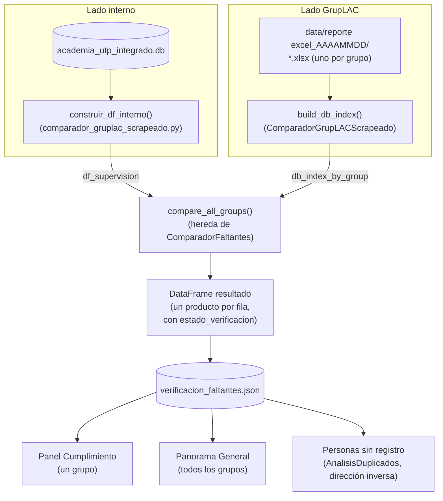
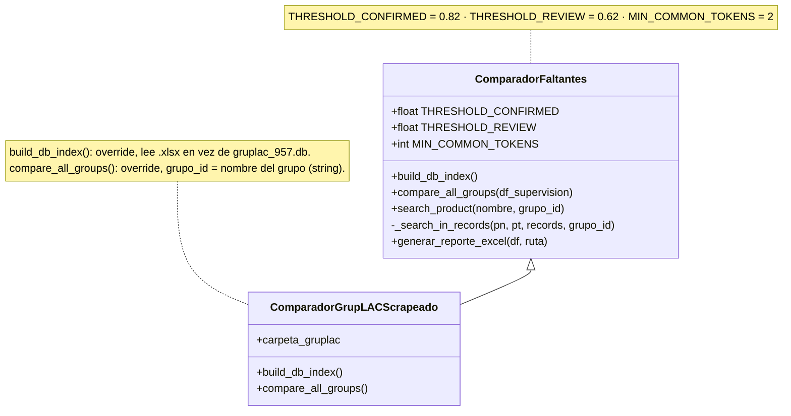
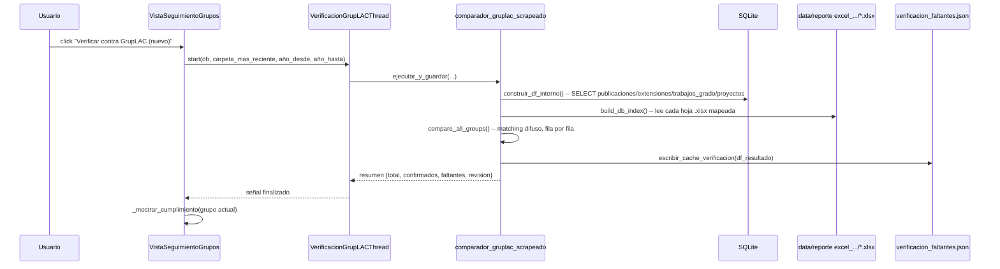

# Verificación contra GrupLAC — pipeline a fondo

Este documento explica cómo funciona la pestaña **Seguimiento Grupos**
(`src/views/vista_seguimiento_grupos.py`) por dentro: de dónde salen los
datos, cómo se comparan, qué significa cada estado, y el historial de bugs
reales encontrados y corregidos (para que quien retome esto no los
reintroduzca sin querer).

## 1. Los dos botones que alimentan todo

| Botón | Qué hace | Dónde queda el resultado |
|---|---|---|
| **Actualizar GrupLAC (Web)** | Descarga (scraping) el perfil público de cada grupo desde scienti.minciencias.gov.co. ~127 grupos, ~4-5 min, con pausa entre cada uno. | `data/reporte excel_<AAAAMMDD>/<GRUPO>/<GRUPO>.xlsx` — una carpeta nueva por corrida, nunca borra las anteriores |
| **Verificar contra GrupLAC (nuevo)** | Compara la BD interna contra la carpeta `reporte excel_<AAAAMMDD>` **más reciente** (no descarga nada) | `data/cache/verificacion_faltantes.json` — se sobrescribe completo cada vez |

Estos dos pasos son independientes. Si quieres verificar contra el estado
*actual* de GrupLAC, primero hay que actualizar (descargar) y después
verificar — verificar solo no trae nada nuevo por sí solo.

## 2. Arquitectura

## 3. El motor de comparación (`comparador_faltantes.py`)

`ComparadorGrupLACScrapeado` **hereda** de `ComparadorFaltantes` y solo
cambia de dónde vienen los datos:

Cada producto interno se busca en dos fases:

1. **Fase 1 — dentro de su propio grupo** (rápido, pocos cientos de registros).
2. **Fase 2 — en todos los demás grupos** (solo si la fase 1 no encontró nada).

Por cada candidato se calcula `combined_score = 0.65·SequenceMatcher + 0.35·Jaccard`
sobre el título normalizado, y el resultado se clasifica así:

| Condición | Estado |
|---|---|
| Coincidencia exacta o `score ≥ 0.82` en el mismo grupo | `Confirmado en BD (mismo grupo)` |
| Coincidencia exacta o `score ≥ 0.82` en OTRO grupo | `Registrado en otro grupo` |
| `0.62 ≤ score < 0.82` | `Segundo barrido - mismo/otro grupo` (revisión manual) |
| Nada por encima de 0.62 | `Faltante real` |

**`Registrado en otro grupo` no siempre significa "no está en GrupLAC"** —
puede significar que el producto SÍ está, pero bajo el perfil de OTRO grupo
al que también pertenece la persona (dato interesante de gobierno de datos,
no un error del sistema).

## 4. Secuencia completa de "Verificar contra GrupLAC (nuevo)"

## 5. Mapeo de hojas GrupLAC → categoría interna

`_MAPEO_HOJAS` (en `comparador_gruplac_scrapeado.py`) traduce cada hoja del
`.xlsx` scrapeado a una de las 4 categorías internas
(`publicaciones` / `extensiones` / `trabajos_grado` / `proyectos`). Cobertura
actual: **73/73 hojas de producto reales** encontradas en los 127 grupos
(el resto son hojas de metadatos del grupo — Datos básicos, Instituciones,
Plan Estratégico, etc. — que correctamente no se comparan).

Si GrupLAC agrega una hoja nueva que no aparece en `_MAPEO_HOJAS`, sus
productos quedan invisibles para la comparación sin ningún error visible —
es la forma más común en que este sistema pierde cobertura silenciosamente.
Para auditar cobertura: enumerar `wb.sheetnames` de todos los `.xlsx` de la
carpeta más reciente y comparar contra `_categoria_de_hoja(nombre)`.

## 6. Bugs reales encontrados y corregidos (2026-07-10/11)

Todos verificados con datos reales antes/después, no solo por lectura de código.

### 6.1 Extracción de título — texto crudo sin parsear
**Dónde**: `_extraer_titulo_anio()` en `comparador_gruplac_scrapeado.py`.
**Síntoma**: productos que sí estaban en GrupLAC salían como "Faltante real"
con similitud 0.0 (caso real: "Laboratorio de creación en terracota bajo
relieve" del grupo LH).
**Causa**: la función asumía que toda fila venía numerada
(`"N.-\nTIPO\n: TÍTULO\n..."`). Las hojas "Talleres de Creación", "Eventos
Artísticos" y "Procesos de apropiación social" NO vienen numeradas — el
título viene pegado a una etiqueta (`"Nombre del taller: TÍTULO ,Tipo de
taller: ..."`), y sin reconocer ese patrón se usaba el bloque de texto
crudo completo como "título".
**Fix**: patrón `_RE_NOMBRE_DEL`, anclado al **inicio** del bloque (no
`.search()` en cualquier parte del texto) para no confundir la etiqueta
principal con etiquetas secundarias más abajo (ver 6.2).

### 6.2 Regresión del fix anterior — etiquetas secundarias
**Síntoma**: filas de `trabajos_grado` con el "producto" = nombre de un
estudiante en vez del título de la tesis.
**Causa**: la primera versión de `_RE_NOMBRE_DEL` usaba `.search()` sin
anclar, y encontraba "Nombre del estudiante:" o "Nombre del orientado:"
(etiquetas secundarias que aparecen más abajo en filas de Trabajos de Grado
y Jurados, que SÍ vienen numeradas y ya funcionaban bien).
**Fix**: anclar el patrón al inicio del bloque (`.match()`, con
`^(?:\d+\.-?\s*)?Nombre del \S+\s*:`) — solo dispara cuando es la etiqueta
principal.

### 6.3 Rendimiento — 7-8 horas en vez de 5 minutos
**Dónde**: `_search_in_records()` en `comparador_faltantes.py`.
**Síntoma**: verificar los ~5.100 productos contra el índice GrupLAC
(~13.000 registros) proyectaba 7-8 horas.
**Causa**: se calculaba el score costoso (`SequenceMatcher`, comparación
carácter a carácter) para **cada** candidato, y solo *después* se revisaba
si compartían suficientes tokens para descartarlo — el filtro barato corría
después del costoso.
**Fix**: mover el filtro de tokens en común (intersección de conjuntos,
barato) ANTES de `combined_score()`. Mismo resultado exacto, ~90x más
rápido (320s en vez de proyectado ~25.000s).

### 6.4 Truncado de nombre de hoja en el orden equivocado
**Dónde**: `_LOOKUP_HOJAS` / `_norm_hoja()` en `comparador_gruplac_scrapeado.py`.
**Síntoma**: "Procesos de apropiación social..." estaba en el mapeo pero
nunca calzaba en 87/127 grupos.
**Causa**: los nombres de hoja de Excel están limitados a 31 caracteres. El
scraper trunca el título crudo a 31 y recién ahí puede quedar un espacio
colgando al final; la clave de búsqueda se armaba normalizando el nombre
completo (con `.strip()`) y truncando *después*, lo que corta en un punto
distinto de la frase.
**Fix**: `_hoja_truncada()` replica el pipeline exacto del scraper (quitar
caracteres ilegales → `.strip()` → truncar a 31) antes de normalizar.

### 6.5 Hojas duplicadas con sufijo " (2)"
**Síntoma**: cuando un grupo tiene dos hojas que truncan al mismo nombre de
31 caracteres (ej. "Producciones de contenido digital - Audiovisual" y
"- Sonoro"), Excel le agrega " (2)" a la segunda y esa hoja queda invisible.
**Fix**: `_RE_SUFIJO_DUP` intenta la clave sin el sufijo como *fallback* en
`_categoria_de_hoja()`. **Limitación conocida**: cuando el truncado de 31
caracteres deja muy poco margen, el nombre re-truncado para dejarle espacio
al sufijo no siempre coincide exactamente — caso residual angosto (~10
grupos), no perseguido más a fondo por ahora.

### 6.6 Grupos con coma en su propio nombre
**Dónde**: `_limpiar_grupos_crudo()` en `comparador_gruplac_scrapeado.py`.
**Síntoma**: "TERRITORIO, EDUCACIÓN Y SOCIEDAD" tenía 15 extensiones reales
pero cero filas en el caché — parecía "sin datos".
**Causa**: la columna `grupo` de `extensiones`/`proyectos` a veces trae
varios grupos separados por coma en una celda (`"COL0002859-AUTOMÁTICA,
COL0077968-OTRO"`). La función partía a ciegas por comas — pero al menos
**11 grupos no-semillero** tienen coma en su propio nombre oficial, y se
rompían en fragmentos inexistentes (`"TERRITORIO"` + `"EDUCACIÓN Y
SOCIEDAD"`).
**Fix**: un fragmento después de una coma solo cuenta como grupo *nuevo* si
trae su propio código al inicio (patrón real de "varios grupos en una
celda"); si no, la coma se reconoce como parte del nombre del grupo
anterior y se vuelve a unir.

### 6.7 Cobertura de hojas — 16 categorías de producto sin mapear
**Síntoma**: hojas reales como "Demás trabajos" (87 grupos), "Estrategias
Pedagógicas para el..." / Programa Ondas (73 grupos), "Obras o productos"
(18 grupos, relevante para grupos de arte), etc. no estaban en
`_MAPEO_HOJAS` — sus productos nunca se comparaban, siempre "Faltante"
pase lo que pase.
**Fix**: se agregaron las 16 al mapeo (criterio: contenidos/productos de
"Apropiación Social del Conocimiento" e IP → `publicaciones`; actividades
de participación/divulgación → `extensiones`, siguiendo la convención ya
usada en el mapeo existente).

### Impacto acumulado de 6.1–6.7 (mismo rango de años, 2022-2025)

| | Antes | Después |
|---|---|---|
| Confirmados | 967 | 1.014 |
| Faltantes | 2.611 | ~2.480 |
| Cobertura de hojas GrupLAC | ~57/73 | 73/73 |
| Grupos con datos en Panorama General | 123 (de 127) | 124 (de 127) |
| Tiempo de "Verificar contra GrupLAC (nuevo)" | proyectado 7-8h | ~5 min |

## 7. Limitaciones conocidas (no son bugs, quedan anotadas)

- **`productos_innovacion` y `propiedad_intelectual`** (tablas de la BD
  interna) no las toca `construir_df_interno()` — hoy están vacías (0
  filas), así que no hay impacto, pero si algún día se cargan datos ahí
  quedarán invisibles para esta verificación.
- **3 grupos sin ningún producto interno** en 2022-2025 (CENTRO DE
  DESARROLLO TECNOLÓGICO AGROINDUSTRIAL CDTA, EDUMEDIA-3, GRUPO DE
  INVESTIGACIÓN EN FARMACOGENÉTICA) — no aparecen en Panorama General
  porque no hay nada que comparar, es el comportamiento correcto.
- El caché **no es incremental**: cada "Verificar contra GrupLAC (nuevo)"
  recalcula todo desde cero (justificado en la sección 6.3 — a ~5 min por
  corrida no hace falta optimizar esto todavía).

## 8. UI que consume el caché

- **Panel Cumplimiento** (`_mostrar_cumplimiento`, dentro de
  `VistaSeguimientoGrupos`): detalle de un grupo, con filtro de estado y
  exportación a Excel de una sola hoja ("Faltantes Detalle").
- **Panorama General** (`DialogoPanoramaGeneral`): agrega el % de
  cumplimiento de todos los grupos (gráfico de barras horizontal, peor a
  mejor, coloreado por banda de estado) y el total de faltantes por
  categoría. Incluye un botón "Generar resumen (IA)" que redacta un párrafo
  narrativo con un modelo local de Ollama (`qwen2.5:3b`) a partir de estos
  mismos datos — no consulta nada adicional ni sale a internet.
- **Personas sin registro (GrupLAC)** (`DialogoDuplicados`): dirección
  inversa — integrantes activos que GrupLAC tiene para un grupo pero que no
  calzan con nadie de la BD interna.
